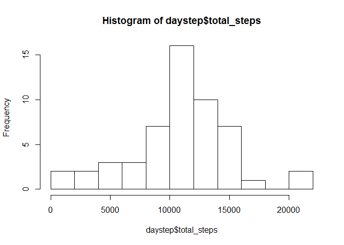
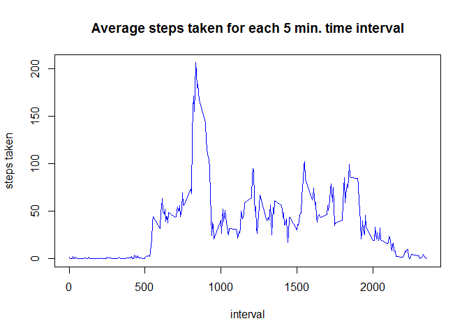
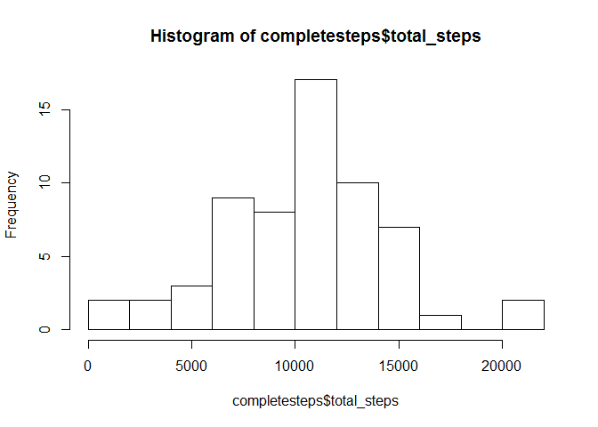
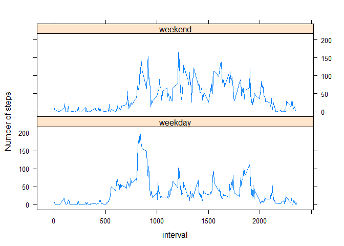

# Reproducible Research: Peer Assessment 1
# Analysis of Fitbit Monitoring Data

## Loading and preprocessing the data

```r
url <- "https://d396qusza40orc.cloudfront.net/repdata%2Fdata%2Factivity.zip"
download.file(url, "activity_monitoring_data.zip")
unzip("activity_monitoring_data.zip")

activity <- read.csv("activity.csv")
```

### Here is a histogram showing the total number of steps taken each day

```r
daystep <- aggregate(activity$steps~activity$date, FUN=sum, na.rm=TRUE)
names(daystep) <- c("date", "total_steps")
hist(daystep$total_steps, breaks = 10)
```

<!-- -->

## What is mean total number of steps taken per day?

```r
mean(daystep$total_steps)
```

```
## [1] 10766.19
```

```r
median(daystep$total_steps)
```

```
## [1] 10765
```


## What is the average daily activity pattern?

```r
avgsteps <- aggregate(activity$steps~activity$interval, FUN=mean, na.rm=TRUE)
names(avgsteps) <- c("interval", "average_steps")
plot(avgsteps$interval, avgsteps$average_steps, type='l', col="blue", xlab="interval", ylab="steps taken", main = "Average steps taken for each 5 min. time interval")
```

<!-- -->

### This will show the 5 min. time interval that, on average, contains the maximum number of steps.  It also shows the average step count for that time period.

```r
library(plyr)
```

```
## Warning: package 'plyr' was built under R version 3.3.2
```

```r
avg_step_order <- ddply(avgsteps, "average_steps",
          function(x) x[which.max(x$average_steps),])
tail(avg_step_order, 1)
```

```
##     interval average_steps
## 254      835      206.1698
```

## Imputing missing values
### This code finds the number of missing values and imputes a value to replace them.

```r
colSums(is.na(activity))
```

```
##    steps     date interval 
##     2304        0        0
```

```r
# this shows there are 2,304 missing values in steps column and 0 elsewhere
# now to impute the data using the mice package
library(mice)
```

```
## Warning: package 'mice' was built under R version 3.3.2
```

```
## Loading required package: Rcpp
```

```
## Warning: package 'Rcpp' was built under R version 3.3.2
```

```
## mice 2.25 2015-11-09
```

```r
tempData <- mice(activity, maxit=50, method="pmm", m = 5, seed = 500)
```

```
## 
##  iter imp variable
##   1   1  steps
##   1   2  steps
##   1   3  steps
##   1   4  steps
##   1   5  steps
##   2   1  steps
##   2   2  steps
##   2   3  steps
##   2   4  steps
##   2   5  steps
##   3   1  steps
##   3   2  steps
##   3   3  steps
##   3   4  steps
##   3   5  steps
##   4   1  steps
##   4   2  steps
##   4   3  steps
##   4   4  steps
##   4   5  steps
##   5   1  steps
##   5   2  steps
##   5   3  steps
##   5   4  steps
##   5   5  steps
##   6   1  steps
##   6   2  steps
##   6   3  steps
##   6   4  steps
##   6   5  steps
##   7   1  steps
##   7   2  steps
##   7   3  steps
##   7   4  steps
##   7   5  steps
##   8   1  steps
##   8   2  steps
##   8   3  steps
##   8   4  steps
##   8   5  steps
##   9   1  steps
##   9   2  steps
##   9   3  steps
##   9   4  steps
##   9   5  steps
##   10   1  steps
##   10   2  steps
##   10   3  steps
##   10   4  steps
##   10   5  steps
##   11   1  steps
##   11   2  steps
##   11   3  steps
##   11   4  steps
##   11   5  steps
##   12   1  steps
##   12   2  steps
##   12   3  steps
##   12   4  steps
##   12   5  steps
##   13   1  steps
##   13   2  steps
##   13   3  steps
##   13   4  steps
##   13   5  steps
##   14   1  steps
##   14   2  steps
##   14   3  steps
##   14   4  steps
##   14   5  steps
##   15   1  steps
##   15   2  steps
##   15   3  steps
##   15   4  steps
##   15   5  steps
##   16   1  steps
##   16   2  steps
##   16   3  steps
##   16   4  steps
##   16   5  steps
##   17   1  steps
##   17   2  steps
##   17   3  steps
##   17   4  steps
##   17   5  steps
##   18   1  steps
##   18   2  steps
##   18   3  steps
##   18   4  steps
##   18   5  steps
##   19   1  steps
##   19   2  steps
##   19   3  steps
##   19   4  steps
##   19   5  steps
##   20   1  steps
##   20   2  steps
##   20   3  steps
##   20   4  steps
##   20   5  steps
##   21   1  steps
##   21   2  steps
##   21   3  steps
##   21   4  steps
##   21   5  steps
##   22   1  steps
##   22   2  steps
##   22   3  steps
##   22   4  steps
##   22   5  steps
##   23   1  steps
##   23   2  steps
##   23   3  steps
##   23   4  steps
##   23   5  steps
##   24   1  steps
##   24   2  steps
##   24   3  steps
##   24   4  steps
##   24   5  steps
##   25   1  steps
##   25   2  steps
##   25   3  steps
##   25   4  steps
##   25   5  steps
##   26   1  steps
##   26   2  steps
##   26   3  steps
##   26   4  steps
##   26   5  steps
##   27   1  steps
##   27   2  steps
##   27   3  steps
##   27   4  steps
##   27   5  steps
##   28   1  steps
##   28   2  steps
##   28   3  steps
##   28   4  steps
##   28   5  steps
##   29   1  steps
##   29   2  steps
##   29   3  steps
##   29   4  steps
##   29   5  steps
##   30   1  steps
##   30   2  steps
##   30   3  steps
##   30   4  steps
##   30   5  steps
##   31   1  steps
##   31   2  steps
##   31   3  steps
##   31   4  steps
##   31   5  steps
##   32   1  steps
##   32   2  steps
##   32   3  steps
##   32   4  steps
##   32   5  steps
##   33   1  steps
##   33   2  steps
##   33   3  steps
##   33   4  steps
##   33   5  steps
##   34   1  steps
##   34   2  steps
##   34   3  steps
##   34   4  steps
##   34   5  steps
##   35   1  steps
##   35   2  steps
##   35   3  steps
##   35   4  steps
##   35   5  steps
##   36   1  steps
##   36   2  steps
##   36   3  steps
##   36   4  steps
##   36   5  steps
##   37   1  steps
##   37   2  steps
##   37   3  steps
##   37   4  steps
##   37   5  steps
##   38   1  steps
##   38   2  steps
##   38   3  steps
##   38   4  steps
##   38   5  steps
##   39   1  steps
##   39   2  steps
##   39   3  steps
##   39   4  steps
##   39   5  steps
##   40   1  steps
##   40   2  steps
##   40   3  steps
##   40   4  steps
##   40   5  steps
##   41   1  steps
##   41   2  steps
##   41   3  steps
##   41   4  steps
##   41   5  steps
##   42   1  steps
##   42   2  steps
##   42   3  steps
##   42   4  steps
##   42   5  steps
##   43   1  steps
##   43   2  steps
##   43   3  steps
##   43   4  steps
##   43   5  steps
##   44   1  steps
##   44   2  steps
##   44   3  steps
##   44   4  steps
##   44   5  steps
##   45   1  steps
##   45   2  steps
##   45   3  steps
##   45   4  steps
##   45   5  steps
##   46   1  steps
##   46   2  steps
##   46   3  steps
##   46   4  steps
##   46   5  steps
##   47   1  steps
##   47   2  steps
##   47   3  steps
##   47   4  steps
##   47   5  steps
##   48   1  steps
##   48   2  steps
##   48   3  steps
##   48   4  steps
##   48   5  steps
##   49   1  steps
##   49   2  steps
##   49   3  steps
##   49   4  steps
##   49   5  steps
##   50   1  steps
##   50   2  steps
##   50   3  steps
##   50   4  steps
##   50   5  steps
```

```r
completeData <- complete(tempData, 1)
#  Show there are no NA values in new data
colSums(is.na(completeData))
```

```
##    steps     date interval 
##        0        0        0
```

### This is a histogram of total # of steps taken each day after missing values imputed

```r
completesteps <- aggregate(completeData$steps~completeData$date, FUN=sum)
names(completesteps) <- c("date", "total_steps")
hist(completesteps$total_steps, breaks=10)
```

<!-- -->

###  Here are the mean and median values after imputing missing values.

```r
mean(completesteps$total_steps)
```

```
## [1] 10399.89
```

```r
median(completesteps$total_steps)
```

```
## [1] 10439
```
### by comparison we see that the mean is 366.3 lower and median 326 lower after imputing values.


## Are there differences in activity patterns between weekdays and weekends?

```r
library(timeDate)
```

```
## Warning: package 'timeDate' was built under R version 3.3.2
```

```r
library(lattice)
completeData$weekday <- as.factor(isWeekend(completeData$date))
levels(completeData$weekday) <- c("weekday", "weekend")
sortedData <- aggregate(completeData$steps~completeData$interval + 
            completeData$weekday, FUN=mean)
names(sortedData) <- c("interval", "weekday", "avg_steps")
xyplot(avg_steps~interval | factor(weekday), data = sortedData, type='l',
       ylab= "Number of steps", layout=c(1,2))
```

<!-- -->
